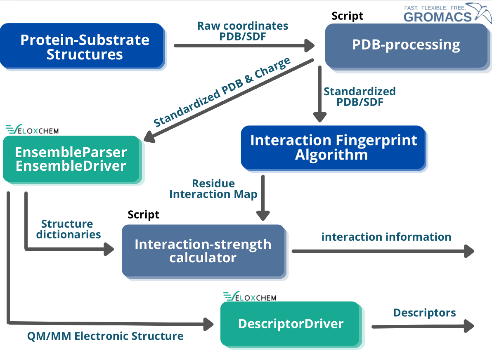

# Master-Thesis-Pipeline

A QM/MM pipeline for high-throughput generation of enzyme-substrate quantum mechanical descriptors and active-site characterization, developed as a master's thesis project in collaboration between KTH and AstraZeneca.

For additional background the thesis Implementation and Generation of Molecular Descriptors for Neural Network Models in Predicitve Enzyme Engineering will be published to diva-portal.org. 
